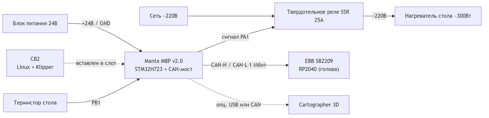
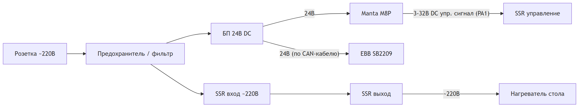
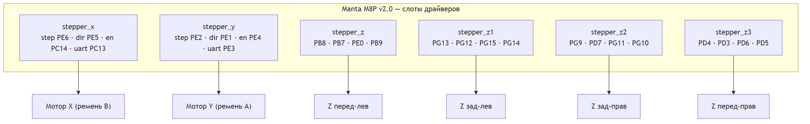
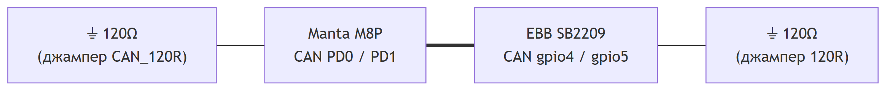
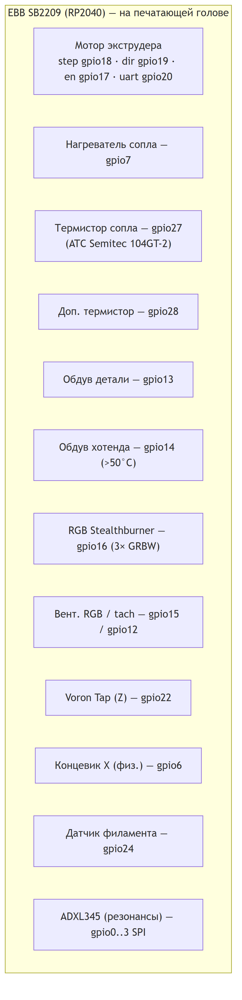
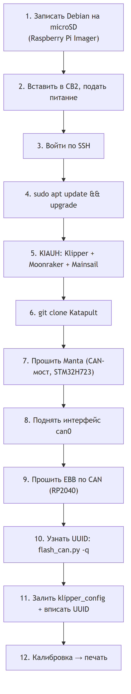

# Voron 2.4 «Gr1mSkull» — Полная инструкция по программному обеспечению

> **Кому адресована.** Этой инструкции достаточно человеку, который ни разу не
> собирал 3D-принтер. Делайте всё строго по порядку, не пропуская шаги.
> Если что-то непонятно — не торопитесь, перечитайте абзац ещё раз.
>
> **Что у вас за принтер.** Voron 2.4, поле печати **500 × 500 × 480 мм**,
> кинематика CoreXY, портал поднимают **4 мотора Z**. Мозг —
> плата **BigTreeTech Manta M8P v2.0** со вставленным мини-компьютером
> **BigTreeTech CB2** (на нём живёт Linux). Голова подключена по шине **CAN**
> через плату **EBB SB2209 (CAN)**.
>
> **В проекте две конфигурации:**
>
> | Папка | Когда использовать |
> |-------|--------------------|
> | `klipper_config/` | **Обычный принтер** — одна несъёмная голова (Clockwork 2 / Stealthburner, хотенд Bambu X1C, проба Voron Tap, опционально Cartographer). **С этого начинаем — это «Принтер 1».** |
> | `stealthchanger_config/` | **Принтер с тулченджером** StealthChanger — 6 сменных голов. Это отдельный, более сложный «Принтер 2». См. [Главу 9](#глава-9--вариант-с-тулченджером-stealthchanger-принтер-2). |
>
> Основная часть инструкции (Главы 1–8) описывает **Принтер 1**.

---

## Содержание

1. [Что вам понадобится](#глава-1--что-вам-понадобится)
2. [Знакомство с платами](#глава-2--знакомство-с-платами)
3. [Коммутация и распиновка (как всё соединить)](#глава-3--коммутация-и-распиновка)
4. [Установка Debian на CB2](#глава-4--установка-debian-на-cb2)
5. [Установка софта: Klipper, Mainsail, Moonraker](#глава-5--установка-софта)
6. [Прошивка плат и настройка CAN-шины](#глава-6--прошивка-плат-и-настройка-can)
7. [Заливка конфигурации принтера](#глава-7--заливка-конфигурации-принтера)
8. [Первый запуск и калибровка](#глава-8--первый-запуск-и-калибровка)
9. [Вариант с тулченджером StealthChanger (Принтер 2)](#глава-9--вариант-с-тулченджером-stealthchanger-принтер-2)
10. [Если что-то пошло не так (FAQ)](#глава-10--если-что-то-пошло-не-так-faq)
- [Приложение A — Схемы](#приложение-a--схемы)

---

## Глава 1 — Что вам понадобится

### 1.1 Железо (уже должно быть в принтере)

| Компонент | Модель в этой сборке |
|-----------|----------------------|
| Материнская плата | BigTreeTech **Manta M8P v2.0** (процессор STM32H723) |
| Хост-компьютер | BigTreeTech **CB2** (вставляется в Manta, на нём Linux) |
| Тулборд (плата головы) | BigTreeTech **EBB SB2209 (CAN)** (процессор RP2040) |
| Моторы XY | 2 шт. (или 4 шт. в режиме AWD) |
| Моторы Z | 4 шт. (quad gantry) |
| Экструдер | Clockwork 2 / Stealthburner |
| Хотенд | Bambu Lab **X1C** 0.4 мм (термистор ≈ ATC Semitec 104GT-2) |
| Z-проба | **Voron Tap** (бесконтактная по соплу) |
| Сканер (опция) | **Cartographer 3D** (сетка стола + резонансы) |
| Стол | нагрев через **твердотельное реле (SSR)**, ~300 Вт |

### 1.2 Что нужно докупить/подготовить

- **microSD-карта** (16 ГБ и больше, класс 10) — для записи образа Linux.
- **Картридер** для microSD (вставить в ноутбук/ПК).
- **Кабель USB-C** — для питания CB2 и/или прошивки Manta по DFU.
- **ПК с Windows/Mac/Linux** — для записи образа и работы по сети.
- **Сеть Wi-Fi или Ethernet** — принтер и ваш ПК должны быть в одной сети.
- Мультиметр (желательно) — прозванивать провода перед подачей питания.

### 1.3 Программы на ПК (скачать заранее)

- **Raspberry Pi Imager** — [raspberrypi.com/software](https://www.raspberrypi.com/software/) (запись образа на карту).
- **Образ Debian для CB2** — со страницы BigTreeTech CB2 (GitHub BIGTREETECH).
- **Терминал SSH**: на Windows — встроенный `ssh` в PowerShell или [PuTTY](https://www.putty.org/); на Mac/Linux — терминал.

> 💡 **Главная идея.** «Мозг» (CB2) — это маленький Linux-компьютер. На нём
> ставится программа **Klipper**, которая управляет моторами и нагревом.
> Платы Manta и EBB — это «руки»: в них заливается прошивка Klipper, и они
> слушаются мозга по проводам (Manta) и по CAN-шине (EBB).

---

## Глава 2 — Знакомство с платами

### 2.1 Manta M8P v2.0 — материнская плата

- Управляет моторами **X, Y, Z (×4)** и при желании двумя доп. моторами AWD.
- Управляет **нагревом стола**, корпусными вентиляторами, подсветкой, реле питания.
- В неё вставляется **CB2** — на нём работает Linux и Klipper.
- Имеет встроенный **CAN-мост** (USB-to-CAN bridge): один разъём CAN, к которому
  подключается голова (EBB) и, при желании, Cartographer.
- Процессор **STM32H723**, частота кварца **25 МГц**, загрузчик **128 KiB**.

### 2.2 CB2 — хост-компьютер (Linux)

- Это «Raspberry-подобный» модуль, который вставляется в слот Manta.
- На нём установлен **Debian Linux** + Klipper + веб-интерфейс Mainsail.
- К нему вы подключаетесь по сети через браузер и по SSH.

### 2.3 EBB SB2209 (CAN) — плата на голове

- Стоит на печатающей голове, тянет один тонкий кабель (CAN + питание) до Manta.
- Управляет **мотором экструдера**, **нагревателем сопла**, **термистором**,
  **вентиляторами** (обдув детали и хотенда), **подсветкой Stealthburner (RGB)**,
  **Voron Tap**, **датчиком филамента**, концевиком X (в физическом режиме).
- Процессор **RP2040**, CAN на ножках **gpio4 / gpio5**.

### 2.4 Cartographer 3D (опционально)

- Индуктивный сканер: строит сетку стола и помогает с резонансами (Input Shaper).
- Подключается либо по **USB**, либо по **CAN**.
- В этой сборке Z-хоуминг всё равно делается через Voron Tap, а Cartographer —
  только сетка + резонансы.

---

## Глава 3 — Коммутация и распиновка

> ⚠️ **БЕЗОПАСНОСТЬ ПРЕЖДЕ ВСЕГО.** Все подключения делайте при **полностью
> отключённом питании** (вилка из розетки). Сетевое напряжение 220 В (блок
> питания, SSR, нагреватель стола) — смертельно опасно. Если не уверены в
> силовой части — пригласите электрика. Перед первой подачей питания проверьте
> мультиметром, что «плюс» и «минус» не перепутаны.

В этом разделе — точная карта пинов. Все значения взяты из ваших рабочих
конфигов, поэтому если соберёте «как в таблице» — софт заведётся без правок пинов.

> 🖼️ **Наглядные схемы соединений** — см. [Приложение A — Схемы](#приложение-a--схемы):
> общая топология, питание, моторы, CAN-шина с терминаторами и распиновка головы.

### 3.1 Питание

| Что | Куда |
|-----|------|
| Блок питания 24 В | силовой вход Manta M8P (клеммы DC IN) |
| 220 В на SSR | сетевой вход SSR (через предохранитель/фильтр) |
| Выход SSR | нагреватель стола (220 В) |
| Управление SSR (низковольтное) | выход **HE-bed** Manta = пин `PA1` |
| Реле питания (ps_on) | пин `PD14` |

> Стол греется через SSR: Klipper подаёт слабый сигнал на пин `PA1`, SSR замыкает
> силовую цепь 220 В. Нагреватель ~300 Вт.

### 3.2 Моторы на Manta M8P (драйверы TMC2209, UART)

| Мотор | step | dir | enable | uart (TMC) | Назначение |
|-------|------|-----|--------|-----------|------------|
| `stepper_x` | PE6 | PE5 | PC14 | PC13 | Ось X (ремень B) |
| `stepper_y` | PE2 | PE1 | PE4 | PE3 | Ось Y (ремень A) |
| `stepper_z`  | PB8  | PB7  | PE0  | PB9  | Z передний-левый |
| `stepper_z1` | PG13 | PG12 | PG15 | PG14 | Z задний-левый |
| `stepper_z2` | PG9  | PD7  | PG11 | PG10 | Z задний-правый |
| `stepper_z3` | PD4  | PD3  | PD6  | PD5  | Z передний-правый |

**Опция AWD (4 мотора XY)** — два доп. мотора в свободные слоты:

| Мотор | step | dir | enable | uart | Назначение |
|-------|------|-----|--------|------|------------|
| `stepper_x1` | PB4 | PB3 | PB6 | PB5 | Доп. мотор X |
| `stepper_y1` | PC7 | PC8 | PD2 | PC6 | Доп. мотор Y |

> ⚠️ **AWD-предупреждение.** Доп. мотор должен тянуть ремень **в ту же сторону**,
> что и основной. Перед первым `G28` проверьте направление командами
> `FORCE_MOVE STEPPER=stepper_x DISTANCE=10 VELOCITY=20` и то же для `stepper_x1`.
> Если едут в разные стороны — добавьте/уберите `!` у `dir_pin` в `drive/xy_awd.cfg`.

### 3.3 Концевики XY

Есть два варианта (выбираете один в конфиге):

**Вариант A — физические концевики (по умолчанию):**

| Ось | Пин | Где разъём |
|-----|-----|-----------|
| X | `EBBCan:gpio6` | на голове (EBB SB2209), порт X-STOP |
| Y | `PF3` | на Manta, порт **M2-STOP** |

**Вариант B — sensorless (без концевиков, по току драйвера):**

| Ось | diag-пин | Параметр чувствительности |
|-----|----------|---------------------------|
| X | `PF4` | `driver_SGTHRS: 80` (подбирается) |
| Y | `PF3` | `driver_SGTHRS: 80` (подбирается) |

### 3.4 Стол и термистор

| Что | Пин на Manta |
|-----|--------------|
| Нагреватель стола (управление SSR) | `PA1` |
| Термистор стола | `PB1` (тип `Generic 3950` — проверьте по кабелю) |

### 3.5 Корпусные вентиляторы и подсветка (Manta)

| Устройство | Пин | Логика работы |
|------------|-----|---------------|
| `controller_fan` (обдув электроники) | `PF6` | включается при нагреве стола >45 °C |
| `exhaust_fan` (вытяжка) | `PF8` | управляется макросами |
| `nevermore` (угольный фильтр) | `PA4` | управляется макросами |
| `caselight` (подсветка камеры) | `PA3` | ШИМ, макросы `LIGHTS_*` |
| `ps_on` (реле питания) | `PD14` | держит питание включённым |

### 3.6 Голова — EBB SB2209 (CAN), пины RP2040

| Устройство | Пин EBB | Примечание |
|------------|---------|-----------|
| Экструдер step / dir / enable | gpio18 / gpio19 / gpio17 | TMC2209 |
| Экструдер UART | gpio20 | |
| Нагреватель сопла | gpio7 | |
| Термистор сопла | gpio27 | `ATC Semitec 104GT-2` (Bambu X1C) |
| Доп. термистор (NTC) | gpio28 | `Generic 3950` |
| Обдув детали (part fan) | gpio13 | |
| Обдув хотенда (heater fan) | gpio14 | вкл. при >50 °C сопла |
| Вентилятор RGB / tach | gpio15 / gpio12 | `sb_leds_fan` |
| RGB Stealthburner (neopixel) | gpio16 | 3 диода, порядок `GRBW` |
| Voron Tap (Z-проба) | gpio22 | предпочтительнее gpio21 |
| Концевик X (физ. режим) | gpio6 | |
| Датчик филамента (runout) | gpio24 | подтяжка `^` |
| ADXL345 (резонансы, опц.) | gpio0–gpio3 | SPI, только при калибровке |

### 3.7 CAN-шина (как голова «разговаривает» с Manta)

```
[ CB2 (Linux) ] --USB(внутри)-- [ Manta M8P = CAN-мост ] --2 провода CAN--> [ EBB SB2209 ]
                                          |
                                          +--(опц.)--> [ Cartographer ]
```

| Узел | CAN-пины | Скорость |
|------|----------|----------|
| Manta M8P | PD0 / PD1 | 1 000 000 (1 Мбит) |
| EBB SB2209 | gpio4 / gpio5 | 1 000 000 |

**Два провода CAN:** `CAN-H` ↔ `CAN-H`, `CAN-L` ↔ `CAN-L`. Не перепутайте местами!
Плюс по тому же кабелю обычно идёт питание головы (+24 В и GND) — отдельной парой.

**Терминаторы 120 Ом** (обязательно ровно два, на концах шины):
- Джампер **CAN_120R** на Manta M8P.
- Джампер **120R** на EBB SB2209.
- Если добавляете Cartographer на CAN и он — конец шины, терминатор ставится у него,
  а не на EBB (на одном конце — один терминатор).

> 💡 **Проверка перед включением (чек-лист коммутации):**
> 1. Все моторные разъёмы вставлены до щелчка, провода не перекручены.
> 2. CAN-H/CAN-L не перепутаны, питание головы +/- правильное.
> 3. Стоят ровно **два** терминатора 120 Ом (на концах шины).
> 4. Силовая часть (220 В) изолирована, клеммы затянуты.
> 5. Термисторы вставлены (без термистора Klipper не запустит нагрев).

---

## Глава 4 — Установка Debian на CB2

> Цель главы: записать Linux на карту памяти, вставить её в CB2, подключиться по сети.

### 4.1 Скачать образ

1. Откройте страницу BigTreeTech CB2 на GitHub (раздел **BIGTREETECH-CB1/CB2**).
2. Скачайте официальный образ **Debian** для CB2 (файл вида `CB2_Debian_...img.xz`).
   Это Debian 11 (Bullseye) с уже настроенными драйверами CB2.

### 4.2 Записать образ на microSD

1. Вставьте microSD в картридер, подключите к ПК.
2. Запустите **Raspberry Pi Imager**.
3. Нажмите **CHOOSE OS → Use custom** и выберите скачанный `.img.xz`.
4. Нажмите **CHOOSE STORAGE** и выберите вашу microSD.
   > ⚠️ Внимательно: будет стёрто всё на выбранном носителе. Не перепутайте с флешкой/диском.
5. Нажмите шестерёнку ⚙ (Advanced options) и задайте заранее:
   - **Hostname**: например `voron`.
   - **Enable SSH** → «Use password authentication».
   - **Username / password**: например `biqu` / ваш пароль (запишите!).
   - **Configure wireless LAN**: имя вашей Wi-Fi сети (SSID) и пароль, страна (RU).
   - **Locale / timezone**: ваш часовой пояс.
6. Нажмите **WRITE** и дождитесь окончания записи и проверки.

> 💡 Если CB2 будет подключён кабелем Ethernet — Wi-Fi можно не настраивать.

### 4.3 Первый запуск CB2

1. Выньте карту из ПК, вставьте в слот microSD на CB2.
2. Убедитесь, что CB2 правильно вставлен в Manta M8P.
3. Подайте питание (или подключите USB-C к CB2 по инструкции вашей платы).
4. Подождите 1–3 минуты — система загружается и подключается к сети.

### 4.4 Подключиться по SSH

1. Узнайте IP-адрес CB2: в роутере (список клиентов) или по hostname.
2. На ПК откройте терминал (PowerShell на Windows) и введите:

```bash
ssh biqu@voron.local
```

   Если по имени не находит — используйте IP: `ssh biqu@192.168.1.50`
   (подставьте свой адрес). Первый раз согласитесь с ключом (`yes`), введите пароль.

3. Если видите приглашение вида `biqu@voron:~$` — вы внутри Linux. 🎉

### 4.5 Обновить систему

```bash
sudo apt update && sudo apt upgrade -y
```

Дождитесь окончания. Если предложит перезагрузку — `sudo reboot`, затем снова `ssh`.

---

## Глава 5 — Установка софта

> Ставим: **Klipper** (управление принтером), **Moonraker** (API),
> **Mainsail** (веб-интерфейс), **Crowsnest** (камера), **KlipperScreen** (если есть
> сенсорный экран). Всё это делает один инсталлятор **KIAUH**.

### 5.1 Поставить KIAUH

```bash
cd ~
sudo apt install -y git
git clone https://github.com/dw-0/kiauh.git
./kiauh/kiauh.sh
```

Откроется текстовое меню KIAUH.

### 5.2 Установить компоненты через меню KIAUH

В меню выбирайте пункт **[1] Install**, затем по очереди ставьте:

1. **Klipper** — выберите Python 3, **1** инстанс.
2. **Moonraker** — 1 инстанс.
3. **Mainsail** (или Fluidd — на ваш вкус; Mainsail рекомендуется).
4. **Crowsnest** — если будет камера.
5. **KlipperScreen** — только если стоит сенсорный дисплей (не путать с mini12864;
   в этой сборке экран — это KlipperScreen, отдельно от конфига Klipper).

После установки откройте в браузере на ПК: `http://voron.local` (или IP).
Должен открыться **Mainsail**. Klipper пока будет ругаться, что нет
`printer.cfg` — это нормально, мы зальём его в Главе 7.

### 5.3 Поставить Katapult (загрузчик для прошивки по CAN)

```bash
cd ~
git clone https://github.com/Arksine/katapult.git
```

Katapult нужен, чтобы прошивать Manta и EBB и заливать обновления по CAN без DFU.

---

## Глава 6 — Прошивка плат и настройка CAN

> Здесь мы: 1) прошиваем Manta как CAN-мост, 2) поднимаем сеть `can0`,
> 3) прошиваем голову EBB по CAN, 4) узнаём UUID плат.
>
> Подробный первоисточник — `klipper_config/doc/can0_setup.md`.

### 6.1 Прошить Manta M8P (Katapult + Klipper, режим CAN-мост)

```bash
sudo systemctl stop klipper
cd ~/klipper
make menuconfig
```

В меню выставьте **для Katapult и затем для Klipper одинаково**:

- Microcontroller Architecture: **STMicroelectronics STM32**
- Processor model: **STM32H723**
- Bootloader offset: **128KiB**
- Clock Reference: **25 MHz crystal**
- Communication interface: **USB to CAN bus bridge**
- CAN bus interface pins: **PD0/PD1**
- CAN bus speed: **1000000**

Сначала соберите и прошейте **Katapult** через DFU (зажать **BOOT**, нажать **RESET**):

```bash
cd ~/katapult && make clean && make
sudo dfu-util -a 0 -D out/katapult.bin --dfuse-address 0x08000000:force:leave -d 0483:df11
```

Затем соберите и прошейте **Klipper** поверх (со смещением загрузчика):

```bash
cd ~/klipper && make clean && make
sudo dfu-util -a 0 -d 0483:df11 --dfuse-address 0x08020000 -D ~/klipper/out/klipper.bin
```

### 6.2 Поднять сеть `can0` на CB2

Создайте файл `/etc/network/interfaces.d/can0`:

```bash
sudo nano /etc/network/interfaces.d/can0
```

Вставьте:

```
allow-hotplug can0
iface can0 can static
    bitrate 1000000
    up ip link set $IFACE txqueuelen 1024
```

Сохраните (`Ctrl+O`, `Enter`, `Ctrl+X`), затем:

```bash
sudo ifup can0
ip -details link show can0
```

Должно показать интерфейс `can0` со скоростью `bitrate 1000000`.

Чтобы поднимался после перезагрузки:

```bash
sudo ln -sf /etc/network/interfaces.d/can0 /etc/network/if-up.d/can0
```

### 6.3 Прошить голову EBB SB2209 (RP2040) по CAN

Соберите прошивки под RP2040:

В `make menuconfig` (для Katapult и Klipper):
- Microcontroller: **Raspberry Pi RP2040**
- Communication interface: **CAN bus (gpio4/gpio5)**
- CAN bus speed: **1000000**

Прошивка через CAN (после того как `can0` поднят):

```bash
sudo systemctl stop klipper
python3 ~/katapult/scripts/flash_can.py -i can0 -f ~/katapult/out/katapult.uf2 -u REPLACE_EBB_UUID
python3 ~/katapult/scripts/flash_can.py -i can0 -f ~/klipper/out/klipper.uf2 -u REPLACE_EBB_UUID
```

> Если EBB ещё «чистый», первую заливку Katapult делают в режиме USB/BOOT —
> см. инструкцию к вашей плате. После этого UF2 заливаются по CAN.

### 6.4 Узнать UUID плат

```bash
sudo systemctl stop klipper
python3 ~/katapult/scripts/flash_can.py -q
sudo systemctl start klipper
```

Команда покажет UUID всех CAN-узлов на шине. **Запишите** их:
- UUID **Manta M8P** → пойдёт в `[mcu]`.
- UUID **EBB** → пойдёт в `[mcu EBBCan]`.

---

## Глава 7 — Заливка конфигурации принтера

### 7.1 Скопировать конфиги в Klipper

Скопируйте всё содержимое папки `klipper_config/` (из этого репозитория) в
`~/printer_data/config/` на CB2.

Способы:
- Через Mainsail: вкладка **Machine** → перетащить файлы/папки.
- Или по SSH/SCP с ПК:

```bash
scp -r klipper_config/* biqu@voron.local:~/printer_data/config/
```

### 7.2 Вписать UUID

Откройте `~/printer_data/config/mcu.cfg` (через Mainsail → Machine) и замените:

```ini
[mcu]
canbus_uuid: <UUID Manta из Главы 6.4>
canbus_interface: can0

[mcu EBBCan]
canbus_uuid: <UUID EBB из Главы 6.4>
canbus_interface: can0
```

### 7.3 Выбрать переключатели в `printer.cfg`

Файл `printer.cfg` устроен как «пульт» — раскомментируете нужные строки:

- **Концевики XY** — оставьте РОВНО один:
  ```ini
  [include endstops/endstops_xy_physical.cfg]      # по умолчанию
  # [include endstops/endstops_xy_sensorless.cfg]
  ```
- **Привод XY**: для 2 моторов — ничего не трогаем; для AWD (4 мотора) —
  раскомментируйте `[include drive/xy_awd.cfg]` (и сначала прочтите предупреждение
  о направлении в [3.2](#32-моторы-на-manta-m8p-драйверы-tmc2209-uart)).
- **Cartographer**:
  - **Включён** (Tap = Z-хоуминг, Cartographer = сетка + резонансы):
    ```ini
    [include probes/cartographer.cfg]
    [include bed_mesh/bed_mesh_cartographer.cfg]
    [include input_shaper/input_shaper_cartographer.cfg]
    ```
  - **Выключен** (Tap = Z + сетка, ADXL на EBB):
    ```ini
    [include bed_mesh/bed_mesh_tap.cfg]
    [include input_shaper/input_shaper_ebb.cfg]
    ```
    И в `macros/macros.cfg` поставьте `variable_use_cartographer: False`.

Если используете Cartographer — впишите его serial/UUID в `probes/cartographer.cfg`.

После любых правок нажмите в Mainsail **FIRMWARE_RESTART**.

---

## Глава 8 — Первый запуск и калибровка

> Делайте строго по порядку. После большинства калибровок Klipper попросит
> `SAVE_CONFIG` — это перезапишет нижнюю часть `printer.cfg` подобранными значениями.

| № | Команда / действие | Что проверяем |
|---|--------------------|---------------|
| 1 | `FIRMWARE_RESTART` | Все MCU онлайн, нет ошибок |
| 2 | `QUERY_ENDSTOPS` | Нажмите концевики рукой — статус меняется |
| 3 | `G28 X Y` | Едут в правильную сторону, упираются в концевики |
| 4 | `G32` | Хоуминг + Quad Gantry Level (портал выравнивается) |
| 5 | `PROBE_CALIBRATE` | Z-offset через Voron Tap (бумажный тест), затем `SAVE_CONFIG` |
| 6 | `CARTOGRAPHER_SCAN_CALIBRATE` | Только если Cartographer включён, затем `SAVE_CONFIG` |
| 7 | `PID_CALIBRATE HEATER=extruder TARGET=240` | ПИД сопла, затем `SAVE_CONFIG` |
| 8 | `PID_CALIBRATE HEATER=heater_bed TARGET=60` | ПИД стола, затем `SAVE_CONFIG` |
| 9 | `SHAPER_CALIBRATE` | Резонансы X и Y, затем `SAVE_CONFIG` |

> ⚠️ **Перед `G28`/`G32`:** убедитесь, что стол и портал свободны, ничего не мешает.
> Если ось едет «не туда» — выключите питание и проверьте направление мотора
> (или инвертируйте `dir_pin` символом `!`).

### 8.1 Проверка моторов направления (если что-то едет не туда)

- На CoreXY ось может ехать по диагонали, если перепутаны разъёмы X/Y — поменяйте местами.
- Z едет вниз вместо вверх — инвертируйте `dir_pin` соответствующего `stepper_z*`.

### 8.2 Полезные макросы (уже в конфиге)

| Макрос | Что делает |
|--------|------------|
| `G32` | Хоуминг + QGL + парковка в центр |
| `PRINT_START BED_TEMP=.. EXTRUDER_TEMP=..` | Старт печати (вызывается слайсером) |
| `PRINT_END` | Завершение, ретракт, парковка, вытяжка |
| `LIGHTS_ON/OFF/TOGGLE` | Подсветка камеры |
| `NEVERMORE_ON/OFF` | Угольный фильтр |
| `EXHAUST_ON/OFF` | Вытяжка |
| `STEALTH_LED R= G= B= W=` | Цвет RGB головы |
| `SGTHRS_TEST AXIS=X VALUE=80` | Подбор чувствительности sensorless |

### 8.3 Настройка слайсера

Стартовый G-code:

```gcode
PRINT_START BED_TEMP=[bed_temperature] EXTRUDER_TEMP=[nozzle_temperature]
```

Завершающий G-code:

```gcode
PRINT_END
```

**Готово!** Принтер настроен. Можно печатать калибровочный кубик.

---

## Глава 9 — Вариант с тулченджером StealthChanger (Принтер 2)

> Это **отдельный, более сложный** принтер на 6 сменных голов. Конфиги — в папке
> `stealthchanger_config/`. Первоисточник — `stealthchanger_config/doc/stealthchanger_setup.md`.
> Базовые шаги (Debian, KIAUH, Katapult, CAN) — **те же**, что в Главах 4–6.

### 9.1 Отличия от Принтера 1

| | Принтер 1 | Принтер 2 (StealthChanger) |
|---|---|---|
| Голова | 1 несъёмная (CW2/SB) | **6 сменных** (StealthChanger) |
| Тулборды | 1× SB2209 | **6× SB2209** (EBBT0…EBBT5) |
| Хотенд | Bambu X1C (104GT-2) | Phaetus **Rapido (PT1000)** |
| Z-проба | Voron Tap | **OptoTap** на каждой голове |
| XY-оффсеты голов | — | калибровка пробником **Nudge** |
| Концевик X | на голове | **на раме** (Manta, `PF4`) |
| Доп. софт | стандартный Klipper | + **klipper-toolchanger-easy** |

### 9.2 CAN-шина из 7 узлов

На одной шине: **Manta M8P + 6 голов**. Держите проводку короткой, используйте
витую пару, терминаторы 120 Ом **только на двух физических концах** шины.
Скорость — **1 000 000**, как и у Принтера 1.

### 9.3 Установка klipper-toolchanger-easy

```bash
cd ~
git clone https://github.com/jwellman80/klipper-toolchanger-easy.git
cd ~/klipper-toolchanger-easy
./install.sh
```

Скрипт создаёт в `~/printer_data/config/`:
- `toolchanger/readonly-configs/` — **служебные симлинки, НЕ редактировать**;
- `toolchanger/toolchanger-config.cfg` — пользовательские оверрайды (у нас уже готов);
- `toolchanger/tools/` — примеры (заменяем нашими `T0.cfg … T5.cfg`).

Затем скопируйте содержимое `stealthchanger_config/` в `~/printer_data/config/`,
**сохранив** созданный install.sh каталог `toolchanger/readonly-configs/`.

В `moonraker.conf` добавьте автообновление:

```ini
[update_manager klipper-toolchanger-easy]
type: git_repo
channel: dev
path: ~/klipper-toolchanger-easy
origin: https://github.com/jwellman80/klipper-toolchanger-easy.git
managed_services: klipper
primary_branch: main
```

### 9.4 Что обязательно настроить

| Что | Где |
|-----|-----|
| UUID Manta | `mcu.cfg` |
| UUID голов T0…T5 | `toolchanger/tools/Tx.cfg` (`[mcu EBBTx]`) |
| Координаты доков `params_park_x/y/z` | каждый `Tx.cfg` |
| `sensorless_x/y` (синхронно с endstops) | `toolchanger/toolchanger-config.cfg` |
| Пин и позиция Nudge | `toolchanger-config.cfg` (`tools_calibrate`, `_CALIBRATION_SWITCH`, по умолчанию `^PF0`) |
| Пуллап PT1000 (если нужен) | `Tx.cfg` (`pullup_resistor: 2200`) |
| Термистор стола | `heater/heater_bed.cfg` |
| Углы/точки QGL для 500 мм | `homing/quad_gantry_level.cfg` |

### 9.5 Порядок калибровки

1. `FIRMWARE_RESTART` — все 7 MCU онлайн (**голова должна быть на шаттле!**).
2. Проверить направления моторов и `QUERY_ENDSTOPS`.
3. Откалибровать координаты доков каждой головы (StealthChanger Wiki → Calibration).
4. Проверить смену инструмента: `T0`, `T1` … `T5`, `UNSELECT_TOOL`.
5. С **T0**: `G28` → `QUAD_GANTRY_LEVEL` → `G28 Z`.
6. `PROBE_CALIBRATE` (OptoTap T0) → впишите `z_offset` в `[tool_probe T0]`.
7. Nudge: `CALIBRATE_ALL_OFFSETS` — XY/Z смещения T1…T5 (вписать вручную в `Tx.cfg`).
8. `PID_CALIBRATE` для `extruder`…`extruder5` и `heater_bed`.
9. Input Shaper по каждой голове (раскомментируйте её `[adxl345]` — **по одной!**).

> ⚠️ **Важно для тулченджера:**
> - При старте голова **должна быть на шаттле** (`require_tool_present: True`),
>   иначе Klipper уйдёт в shutdown (Z-проба = OptoTap активной головы).
> - **Всегда** `G28` / `QUAD_GANTRY_LEVEL` / `BED_MESH` делайте с **T0**.
> - **`SAVE_CONFIG` НЕ используется** для оффсетов тулов — значения вписываются
>   вручную в соответствующий `Tx.cfg` (так требует klipper-toolchanger-easy).
> - Одновременно допустим только **один** `[adxl345]` — раскомментируйте
>   акселерометр только у калибруемой головы.
> - **PT1000 (Rapido):** проверьте пуллап на плате; при необходимости
>   раскомментируйте `pullup_resistor` в `Tx.cfg`.

### 9.6 Слайсер (тулченджер)

Стартовый G-code:

```gcode
PRINT_START TOOL={initial_tool} TOOL_TEMP=[nozzle_temperature_initial_layer] BED_TEMP=[bed_temperature_initial_layer]
```

Завершение: `PRINT_END`. Детали смены инструмента — DraftShift StealthChanger Wiki → Slicers.

---

## Глава 10 — Если что-то пошло не так (FAQ)

| Симптом | Причина / решение |
|---------|-------------------|
| Mainsail пишет «Klipper: error» / нет MCU | Проверьте UUID в `mcu.cfg`; `can0` поднят (`ip link show can0`); терминаторы 120 Ом стоят. |
| `Unable to connect` / CAN не видит EBB | Перепутаны CAN-H/CAN-L; нет питания головы; не два терминатора; неверная скорость (должна быть 1000000 везде). |
| `flash_can.py -q` ничего не находит | `sudo systemctl stop klipper`, затем повторить; проверьте, что EBB прошит Katapult. |
| Ось едет не в ту сторону | Инвертируйте `dir_pin` (символ `!`) или поменяйте разъёмы; на CoreXY проверьте пару X/Y. |
| `G28` упирается, но не останавливается | Концевик не срабатывает — проверьте `QUERY_ENDSTOPS`, пин и подтяжку `^`. |
| Воздух/недостаток нагрева сопла | Проверьте тип термистора: X1C = `ATC Semitec 104GT-2`, Rapido = `PT1000`. |
| Стол не греется | Проверьте сигнал на `PA1` и сам SSR; термистор стола `PB1`. |
| Sensorless не хоумится | Подберите чувствительность: `SGTHRS_TEST AXIS=X VALUE=80` (меняйте 60–120). |
| Cartographer не подключается | Впишите верный `serial`/`canbus_uuid` в `probes/cartographer.cfg`. |
| Тулченджер уходит в shutdown при старте | Голова не на шаттле — наденьте голову, затем `FIRMWARE_RESTART`. |

### Полезные команды диагностики

```bash
# Логи Klipper в реальном времени
tail -f ~/printer_data/logs/klippy.log

# Состояние CAN-интерфейса
ip -details -statistics link show can0

# Перезапуск сервисов
sudo systemctl restart klipper
sudo systemctl restart moonraker
```

---

### Краткая «шпаргалка» порядка действий (Принтер 1)

1. Скоммутировать платы по [Главе 3](#глава-3--коммутация-и-распиновка) (питание в последнюю очередь).
2. Записать Debian на карту → вставить в CB2 → `ssh` ([Глава 4](#глава-4--установка-debian-на-cb2)).
3. KIAUH: Klipper + Moonraker + Mainsail ([Глава 5](#глава-5--установка-софта)).
4. Прошить Manta (CAN-мост) и EBB, поднять `can0`, узнать UUID ([Глава 6](#глава-6--прошивка-плат-и-настройка-can)).
5. Залить `klipper_config/`, вписать UUID, выбрать переключатели ([Глава 7](#глава-7--заливка-конфигурации-принтера)).
6. Откалибровать по таблице ([Глава 8](#глава-8--первый-запуск-и-калибровка)) → печать.

Удачной печати! 🐈

---

## Приложение A — Схемы

> Ниже — готовые картинки (PNG), они открываются на любом устройстве, включая
> **iPad**. Файлы лежат в папке [`images/`](images/). Редактируемые исходники
> диаграмм — рядом в файлах `images/*.mmd` (формат Mermaid); после правки их можно
> заново отрисовать командой из [раздела A.8](#a8-как-перерисовать-схемы).
>
> Дополняют таблицы из [Главы 3](#глава-3--коммутация-и-распиновка).

### A.1 Общая топология системы (Принтер 1)

Как связаны мозг (CB2), материнка (Manta), голова (EBB), питание и стол.



### A.2 Питание (силовая часть) — будьте осторожны, 220В!



### A.3 Моторы на Manta M8P (драйверы TMC2209)



> Опция AWD добавляет `stepper_x1` (step PB4 · dir PB3 · en PB6 · uart PB5) и
> `stepper_y1` (step PC7 · dir PC8 · en PD2 · uart PC6) в свободные слоты.

### A.4 CAN-шина и терминаторы (Принтер 1)

Ровно **два** терминатора 120 Ом — на физических концах шины.



Если Cartographer добавляется на CAN и он — конец шины, терминатор переносится к нему:


### A.5 Голова — EBB SB2209 (что куда подключено)



### A.6 Маршрутная карта установки софта



### A.7 Топология CAN для тулченджера (Принтер 2, 7 узлов)


> Шина — это **одна линия** (daisy-chain). Терминаторы 120 Ом стоят только на её
> двух физических концах (здесь: у Manta и у последней головы EBBT5). Промежуточные
> узлы терминаторы НЕ ставят.

### A.8 Как перерисовать схемы

Если поправили `.mmd`-исходник и хотите обновить картинку (нужен Node.js):

```bash
npx -y @mermaid-js/mermaid-cli@latest -i images/a1-topology.mmd -o images/a1-topology.png -b white -s 3
```

Все сразу (PowerShell):

```powershell
Get-ChildItem images/*.mmd | ForEach-Object {
    npx -y @mermaid-js/mermaid-cli@latest -i $_.FullName -o ($_.FullName -replace '\.mmd$','.png') -b white -s 3
}
```
